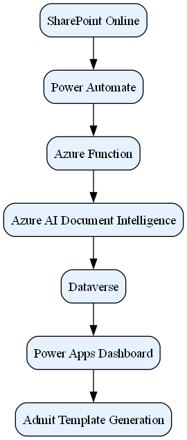

# Home-HITH Architecture

## Overview

Home-HITH automates admit-document processing using:

- SharePoint Online
- Power Automate
- Azure Functions
- Azure AI Document Intelligence
- Microsoft Dataverse
- Power Apps

---

## Architecture Diagram



*Figure 1. End-to-end Home-HITH admit document automation architecture.*

---

## Business Objective

Home-HITH streamlines the intake and processing of hospital-at-home (HITH) admission documents by automatically extracting patient information from paired PDF and Word documents stored in SharePoint, transforming the data into structured records within Dataverse, and generating completed admit templates for clinical workflows.

---

## Data Flow

```text
SharePoint Online
        │
        ▼
Power Automate
        │
        ▼
Azure Function
        │
        ▼
Azure AI Document Intelligence
        │
        ▼
Microsoft Dataverse
        │
        ├──────────────► Power Apps Dashboard
        │
        ▼
Admit Template Generation
        │
        ▼
Completed HITH Admit Document
```

---

## Processing Pipeline

### 1. Document Intake

Admission documents are uploaded to SharePoint using a predefined naming convention:

```text
<patientID>_facesheet.pdf
<patientID>_assessment.docx
```

The patient identifier is extracted from the filename and used to pair related documents.

### 2. Automated Trigger

A Power Automate flow monitors the SharePoint library and triggers processing whenever new admit-document pairs are detected.

### 3. Document Processing

An Azure Function downloads the paired documents and orchestrates the extraction workflow.

### 4. AI Data Extraction

Azure AI Document Intelligence processes the documents and extracts structured clinical and administrative information.

Example fields may include:

- Patient Identifier
- Admission Date
- Diagnosis
- Referring Clinician
- Care Team Information

### 5. Dataverse Storage

Extracted data is validated and stored in the Dataverse table:

```text
hith_admitdata
```

### 6. Operational Dashboard

Power Apps consumes Dataverse records to provide a real-time operational dashboard for monitoring admissions and processing status.

### 7. Admit Template Generation

A secondary Power Automate workflow generates a populated HITH Admit document from a Word template using the extracted data.

---

## Solution Components

| Component | Purpose |
|-----------|---------|
| SharePoint Online | Source document repository |
| Power Automate | Workflow orchestration |
| Azure Function | Processing engine |
| Azure AI Document Intelligence | Data extraction and classification |
| Microsoft Dataverse | Structured data storage |
| Power Apps | Dashboard and user experience |
| Word Template Engine | Admit document generation |

---

## Deployment Documentation

The following operational documents support deployment, configuration, and maintenance of the Home-HITH platform.

| Document | Description |
|-----------|-------------|
| [Deployment Guide](../deployment/deployment-guide.md) | End-to-end deployment instructions for Azure, SharePoint, Dataverse, and Power Platform components |
| [Environment Variables Reference](../deployment/environment-variables.md) | Configuration settings, secrets, and runtime environment variables |

---

## Repository Structure

```text
docs/
├── architecture/
│   └── solution-overview.md
├── deployment/
│   ├── deployment-guide.md
│   └── environment-variables.md
└── screenshots/
    └── 01-architecture-overview.png

src/
├── python/
├── dataverse/
├── flows/
└── power-apps/
```

---

## Key Benefits

- Reduces manual data entry
- Improves data quality and consistency
- Accelerates admission processing
- Provides real-time operational visibility
- Supports scalable document automation
- Leverages Microsoft 365 and Power Platform services

---

## Future Enhancements

- Exception handling dashboard
- Automated validation workflows
- Audit and compliance reporting
- CI/CD deployment pipelines
- Power Platform ALM integration
- Observability and monitoring dashboards